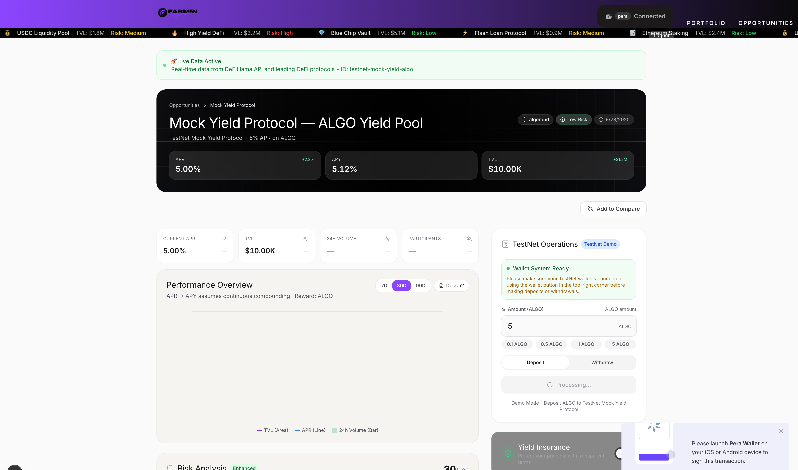

# Farmin - DeFi Yield Aggregator

<div align="center">
  

  [](https://opensource.org/licenses/MIT)
  [](https://nodejs.org/)
  [](https://www.typescriptlang.org/)
  [](https://pnpm.io/)

  **Multi-chain DeFi yield aggregator powered by Algorand**
</div>

Farmin is a sophisticated DeFi yield aggregator and protocol that operates across multiple blockchain networks, with a primary focus on Algorand. The protocol enables users to discover, compare, and automatically allocate funds to the highest-yielding DeFi opportunities while minimizing risk through advanced analytics and portfolio management.

## 🏗️ Architecture Overview

### Monorepo Structure

Farmin is organized as a **pnpm monorepo** with a clear separation of concerns:

```
farmin/
├── apps/
│   └── web/                    # Next.js web application
├── packages/
│   ├── adapters/              # DeFi protocol adapters
│   ├── contracts/             # Algorand smart contracts
│   └── shared/                # Shared types and utilities
├── scripts/                   # Build and deployment scripts
└── docs/                      # Documentation
```

### Technology Stack

| Layer | Technology | Purpose |
|-------|------------|---------|
| **Frontend** | Next.js 15, React 18, TypeScript | User interface and interactions |
| **State Management** | Zustand, TanStack Query | Client-side state and server data |
| **Styling** | Tailwind CSS, DaisyUI | UI components and design system |
| **Blockchain** | Algorand (algosdk) | Primary blockchain network |
| **Wallet Integration** | @txnlab/use-wallet-react | Multi-wallet support |
| **Smart Contracts** | TEAL, algokit-utils | Algorand smart contracts |
| **Data Aggregation** | Custom adapters | Multi-protocol yield data |
| **Database** | SQLite (better-sqlite3) | Local caching and analytics |
| **Build System** | TypeScript, pnpm, ESLint | Development toolchain |

## 📦 Package Deep Dive

### 1. `@farmin/contracts` - Smart Contract Layer

**Purpose**: Algorand smart contracts for yield routing and management

**Core Components**:
- **Router Contract**: Central routing logic for deposits/withdrawals
- **Mock-Yield Contract**: Simulated yield generation for testing
- **ABI Utilities**: Method selectors and argument encoding
- **Type Definitions**: ARC-4 compliant types and interfaces

**Key Features**:
- ARC-4 compliant ABI encoding
- Transaction grouping for atomic operations
- Global state management for contract configuration
- Local state tracking for user positions
- Multi-asset support (ALGO and ASAs)

**Smart Contract Architecture**:
```typescript
// Router Contract manages:
// - Protocol whitelisting
// - Per-transaction caps
// - Pause/resume functionality
// - Deposit/withdrawal routing

// Mock-Yield Contract provides:
// - APY configuration (basis points)
// - Deposit/withdrawal operations
// - Yield calculation with time-weighted returns
// - TVL tracking
```

**Deployment Workflow**:
1. Compile TEAL programs using `algodClient.compile()`
2. Create application with configured state schema
3. Deploy to network (localnet/testnet/mainnet)
4. Initialize global state and configuration

### 2. `@adapters/core` - Protocol Integration Layer

**Purpose**: Multi-protocol DeFi data aggregation and analysis

**Architecture Pattern**: Adapter pattern for protocol abstraction

**Core Components**:
- **AdapterManager**: Central coordinator for all adapters
- **Protocol Adapters**: Individual protocol implementations
- **Analytics Engine**: Yield calculation and risk analysis
- **Cache Management**: Intelligent caching with TTL
- **Risk Assessment**: Multi-factor risk scoring

**Adapter System**:
```typescript
// Current Adapters:
// - DefiLlamaAdapter: Multi-chain yield data
// - Future: Uniswap, Compound, Raydium, etc.

// Adapter Interface:
interface Adapter {
  name: string;
  chain: Chain;
  fetchOpportunities(): Promise<Opportunity[]>;
  getStats(): Promise<AdapterStats>;
  calculateRisk(opportunity: Opportunity): Promise<RiskScore>;
}
```

**Analytics Capabilities**:
- **Yield Calculation**: APY/APR conversion and compounding
- **Risk Assessment**: Protocol risk, liquidity risk, impermanent loss
- **Portfolio Optimization**: Efficient frontier calculations
- **Historical Analysis**: Time-series data processing

### 3. `@shared/core` - Shared Infrastructure

**Purpose**: Common types, utilities, and shared business logic

**Core Components**:
- **Type Definitions**: Shared TypeScript interfaces
- **Utilities**: Common helper functions
- **Constants**: Configuration constants
- **Error Handling**: Standardized error types

### 4. `web` - Next.js Application

**Purpose**: User interface and client-side logic

**Architecture**: Next.js 15 with App Router (partial implementation)

**Key Features**:
- **Multi-Wallet Support**: Pera, Defly, KMD (localnet)
- **Real-time Data**: Live yield updates and portfolio tracking
- **Responsive Design**: Mobile-first approach
- **Type Safety**: Full TypeScript integration

**Wallet Integration**:
```typescript
// Wallet Architecture:
// - WalletAppProvider: Environment-based wallet configuration
// - Network detection: auto-selects based on ALGOD_NETWORK
// - Multi-wallet support: Pera/Defly for public nets, KMD for localnet
// - Transaction management: Grouped transactions for atomic operations
// - Event logging: Comprehensive wallet event tracking
```

**State Management**:
- **Zustand**: Lightweight state management for UI state
- **TanStack Query**: Server state management and caching
- **Local Storage**: Persistent user preferences

## 🔧 Development Workflow

### Environment Setup

**Required Environment Variables**:
```bash
# Algorand Network Configuration
NEXT_PUBLIC_ALGOD_SERVER=http://localhost
NEXT_PUBLIC_ALGOD_PORT=4001
NEXT_PUBLIC_ALGOD_TOKEN=a"*.token
NEXT_PUBLIC_ALGOD_NETWORK=localnet

# Optional: Indexer Configuration
NEXT_PUBLIC_INDEXER_SERVER=http://localhost
NEXT_PUBLIC_INDEXER_PORT=8980
NEXT_PUBLIC_INDEXER_TOKEN=a"*.token

# Localnet KMD Configuration (only for localnet)
KMD_TOKEN=a"*.token
KMD_SERVER=http://localhost
KMD_PORT=4002
```

**Development Commands**:
```bash
# Root level commands
pnpm dev              # Start web development server
pnpm build            # Build all packages and apps
pnpm test             # Run all tests
pnpm lint             # Run linting across all packages
pnpm typecheck        # Run TypeScript checking

# Package-specific commands
pnpm --filter web dev           # Start Next.js dev server
pnpm --filter @adapters/core test  # Run adapter tests
pnpm --filter @farmin/contracts deploy:localnet  # Deploy contracts
```

### Build System

**Compilation Order**:
1. **Packages First**: Build shared dependencies
2. **Contracts**: Compile smart contracts
3. **Adapters**: Build protocol adapters
4. **Web Application**: Build Next.js app

**TypeScript Configuration**:
- Strict mode enabled
- Path aliases for clean imports
- Project references for monorepo support
- Declaration files for library packages

### Testing Strategy

**Smart Contract Testing**:
- Unit tests for contract methods
- Integration tests for contract interactions
- End-to-end tests using localnet
- Jest with TypeScript support

**Adapter Testing**:
- Mocked API responses for reliability
- Data validation tests
- Performance benchmarking
- Error handling scenarios

**Web Application Testing**:
- Component testing with React Testing Library
- Integration testing for wallet flows
- E2E testing for critical user journeys

## 🚀 Deployment

### Smart Contract Deployment

**Localnet Development**:
```bash
# Start Algorand localnet
docker-compose up -d

# Deploy contracts
cd packages/contracts
pnpm deploy:localnet
```

**Testnet Production**:
```bash
# Deploy to testnet
pnpm deploy:testnet

# Run E2E tests
pnpm e2e:testnet
```

### Web Application Deployment

**Build Process**:
```bash
# Build entire monorepo
pnpm build

# Start production server
cd apps/web
pnpm start
```

**Deployment Targets**:
- **Vercel**: Recommended for Next.js applications
- **Netlify**: Static site deployment
- **Self-hosted**: Docker containers

## 🔐 Security Considerations

### Smart Contract Security

**Security Measures**:
- **Input Validation**: Comprehensive input sanitization
- **Access Control**: Admin-only operations
- **Rate Limiting**: Per-transaction caps
- **Pause Functionality**: Emergency stop capability
- **Audit Trail**: Complete transaction logging

**Risk Mitigation**:
- **Multi-sig Admin**: Multiple signers for critical operations
- **Time Locks**: Delayed execution of sensitive operations
- **Circuit Breakers**: Automatic halt on异常 conditions
- **Insurance**: Built-in insurance mechanisms

### Frontend Security

**Security Measures**:
- **Environment Variables**: Secure configuration management
- **CSP Headers**: Content Security Policy
- **XSS Protection**: Input sanitization and encoding
- **CSRF Protection**: Token-based validation
- **Wallet Security**: Secure key management

### Data Security

**Security Measures**:
- **Encryption**: Sensitive data encryption at rest
- **API Security**: Rate limiting and authentication
- **Data Validation**: Comprehensive input validation
- **Audit Logging**: Complete audit trail
- **Backup Strategy**: Regular data backups

## 📊 Performance Optimization

### Frontend Optimization

**Performance Techniques**:
- **Code Splitting**: Dynamic imports and route-based splitting
- **Image Optimization**: Next.js Image component
- **Caching Strategy**: Multi-layer caching approach
- **Bundle Analysis**: Regular bundle size monitoring
- **Lazy Loading**: On-demand component loading

### Backend Optimization

**Performance Techniques**:
- **Database Optimization**: Indexing and query optimization
- **API Caching**: Intelligent caching with TTL
- **Background Jobs**: Asynchronous processing
- **Connection Pooling**: Efficient database connections
- **Load Balancing**: Horizontal scaling capabilities

## 🔄 Integration Patterns

### Wallet Integration

**Multi-Wallet Support**:
```typescript
// Supported Wallets:
// - Pera Wallet (production)
// - Defly Wallet (production)
// - KMD Wallet (localnet development)
// - WalletConnect (future)

// Integration Pattern:
// 1. Environment-based configuration
// 2. Automatic network detection
// 3. Unified transaction interface
// 4. Comprehensive event logging
```

### Protocol Integration

**Adapter Pattern**:
```typescript
// Integration Steps:
// 1. Implement Adapter interface
// 2. Add protocol-specific logic
// 3. Implement data fetching
// 4. Add risk calculation
// 5. Register with AdapterManager
```

## 🎯 Roadmap

### Phase A: Algorand Focus ✅
- [x] Algorand smart contracts
- [x] Multi-wallet integration
- [x] Basic yield aggregation
- [x] Web application interface

### Phase B: Multi-Chain Expansion 🚧
- [ ] Ethereum integration
- [ ] Solana integration
- [ ] Cross-chain bridges
- [ ] Advanced analytics

### Phase C: Advanced Features 📋
- [ ] Mobile application
- [ ] Governance tokens
- [ ] Insurance mechanisms
- [ ] Institutional features

## 📸 Screenshots

### Landing Page
<div align="center">
  
</div>

### Wallet Integration
#### Wallet Connection
<div align="center">
  
</div>

#### Mobile Connection
<div align="center">
  
</div>

### Yield Opportunities
#### Opportunities Listing
<div align="center">
  
</div>

#### Mock Yield Interface
<div align="center">
  
</div>

### Portfolio Management
#### Portfolio Overview
<div align="center">
  
  
</div>

### Real-time Data Analysis
#### Detailed Analytics
<div align="center">
  
</div>

#### Advanced Analytics
<div align="center">
  
</div>

## 🤝 Contributing

### Development Setup
```bash
# Clone repository
git clone https://github.com/your-org/farmin.git
cd farmin

# Install dependencies
pnpm install

# Build packages
pnpm build

# Start development
pnpm dev
```

### Code Standards
- **TypeScript**: Strict mode enabled
- **ESLint**: Configured with Airbnb style guide
- **Prettier**: Consistent code formatting
- **Git Hooks**: Pre-commit checks for quality
- **Testing**: Jest for unit and integration tests

### Contribution Workflow
1. Fork the repository
2. Create feature branch
3. Implement changes with tests
4. Run linting and type checking
5. Submit pull request
6. Code review and approval

## 📄 License

This project is licensed under the MIT License - see the [LICENSE](LICENSE) file for details.

## 🆘 Support

For support, please join our [Discord](https://discord.gg/farmin) or create an issue on [GitHub](https://github.com/your-org/farmin/issues).

---

**Built with ❤️ by the Farmin Team**